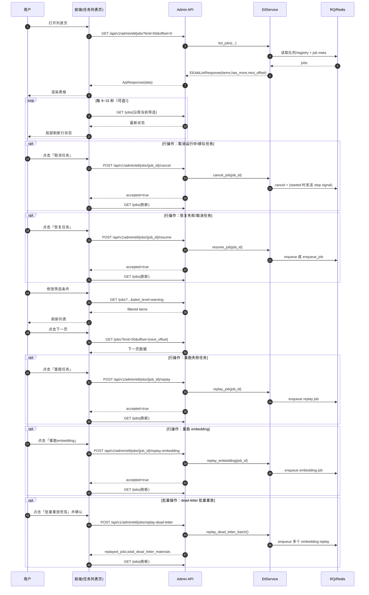
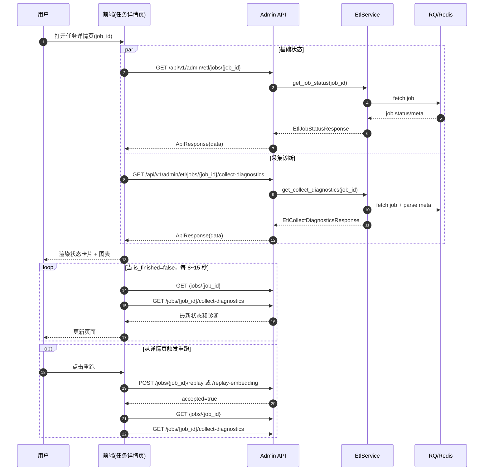
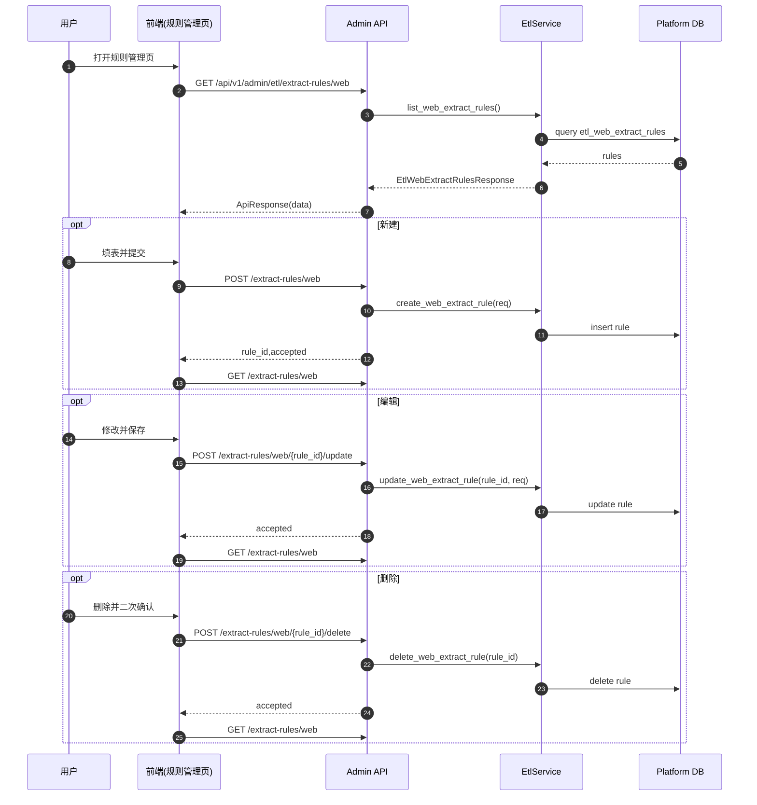
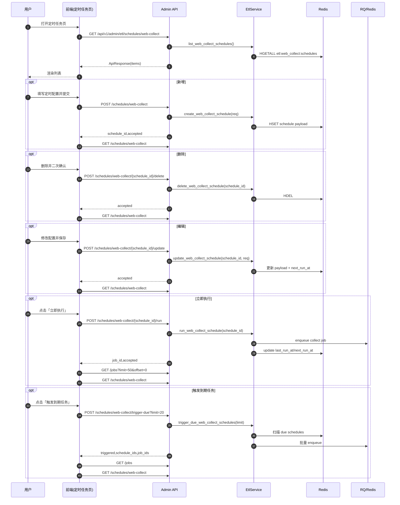
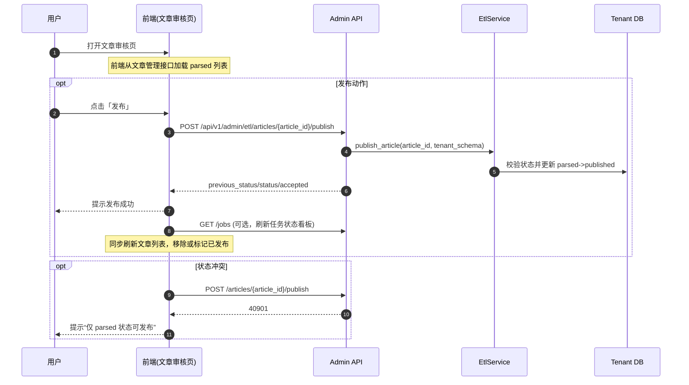

# ETL 前端页面级接口调用时序图

本文档用于前端后台管理系统实现阶段，给出页面级 API 调用时序（Mermaid），覆盖：

1. 任务列表页（筛选/分页/重跑）
2. 任务详情页（状态轮询 + 诊断）
3. 抽取规则管理页（CRUD）
4. 定时采集管理页（V2）

API 参考：`docs/modules/etk/ETL_ADMIN_API.md`
任务拆分参考：`docs/modules/etk/ETL_FRONTEND_WBS.md`

> 本期范围说明：CSV 前端入口暂缓，本文件默认按“网页采集 + 任务可视化 + 操作闭环 + 规则/调度 + 发布”实施。

## 0) 执行顺序（先做什么）

1. 任务列表页（含看板、筛选、分页、轮询）
2. 任务详情页（状态 + 诊断 + 图表）
3. 任务操作闭环（cancel/resume/replay/replay-embedding/replay-dead-letter）
4. 规则管理页（CRUD）
5. 调度管理页（CRUD + run + trigger-due）
6. 文章发布闭环（parsed -> published）

### 0.1 提测前烟囱清单（必须通过）

- 任意写操作成功后，统一刷新：`/jobs` + 当前详情（如在详情页）+ `/metrics/summary`
- 对 `40901/40401/50010` 有稳定业务提示，不出现白屏
- 列表和详情在弱网下可降级显示（保留基础状态与重试入口）
- 页面隐藏时暂停轮询，回到前台自动恢复轮询

---

## 1) 任务列表页（Job List）

页面目标：

- 展示任务表格
- 支持筛选（tenant/job_type/status/has_dead_letter/quality_score_lt/alert_level）
- 支持 offset 分页
- 支持行级操作（取消、恢复、重跑任务、重跑 embedding）
- 支持批量 dead-letter replay

---

## 2) 任务详情页（Job Detail + Diagnostics）

页面目标：

- 展示单任务基础状态
- 展示采集诊断（失败原因分布、extractor 占比、质量与告警）
- 在 `is_finished=false` 时轮询

图表映射建议：

- 失败原因柱状图：`collect_reason_counts`
- 抽取通道占比饼图：`extractor_counts`
- 质量与告警卡片：`quality_score_avg`、`low_quality_ratio`、`alert_level`
- embedding 进度条：`embedded_materials` / `embedding_failed_materials` / `embedding_retry_pending_materials`
- S2 质量卡片：`s2_annotations_count`、`s2_invalid_ratio`、`s2_deduplicated_ratio`

---

## 3) 抽取规则管理页（Rules CRUD）

页面目标：

- 列表展示规则
- 新建规则
- 编辑规则（部分更新）
- 删除规则

---

## 4) 前端实现建议（简版）

1. 列表筛选条件入 URL Query，便于分享和刷新恢复。
2. 所有写操作（replay、rules CRUD）完成后立即刷新对应列表。
3. 对 `40901`（状态冲突）做业务提示，不弹系统错误。
4. `alert_level` 色彩规范统一：`critical` 红、`warning` 橙、`normal` 灰/绿。
5. 详情页轮询可在标签页隐藏时暂停（节流）。

---

## 5) 定时采集管理页（Schedules V2）

页面目标：

- 展示定时任务列表
- 支持新增/编辑/删除
- 支持单任务立即执行
- 支持批量触发到期任务

---

## 5.1) 文章审核/发布闭环（Article Publish）

页面目标：

- 展示可发布文章（`status=parsed`）
- 支持发布动作（`parsed -> published`）
- 发布后回流刷新任务与文章视图，形成业务闭环

---

## 6) 闭环实施验收（前端交付必须通过）

### 6.1 页面级最小闭环

1. 任务列表页：可筛选、可分页、可轮询、可执行行操作
2. 任务详情页：状态 + 诊断 + 图表全部可展示
3. 规则管理页：新增/编辑/删除全链路可用
4. 定时任务页：新增/编辑/删除/立即执行/触发到期全链路可用

### 6.2 交互闭环规则

1. 所有写操作成功后，统一刷新：`/jobs`、当前详情页（如有）、`/metrics/summary`
2. 对 `40901` 显示业务提示（不可操作状态），不弹系统异常
3. 对 `40401` 显示资源不存在提示，并引导返回列表
4. 图表接口失败时页面不白屏，保留表格和基础状态

### 6.3 质量指标闭环

前端至少要能在列表或详情完整展示：

- 内容抽取质量：`quality_score_avg`、`low_quality_ratio`
- 向量风险：`embedding_dead_letter_materials`、`embedding_dead_letter_ratio`
- S2 质量：`s2_invalid_ratio`、`s2_deduplicated_ratio`
- 综合风险：`alert_level`
